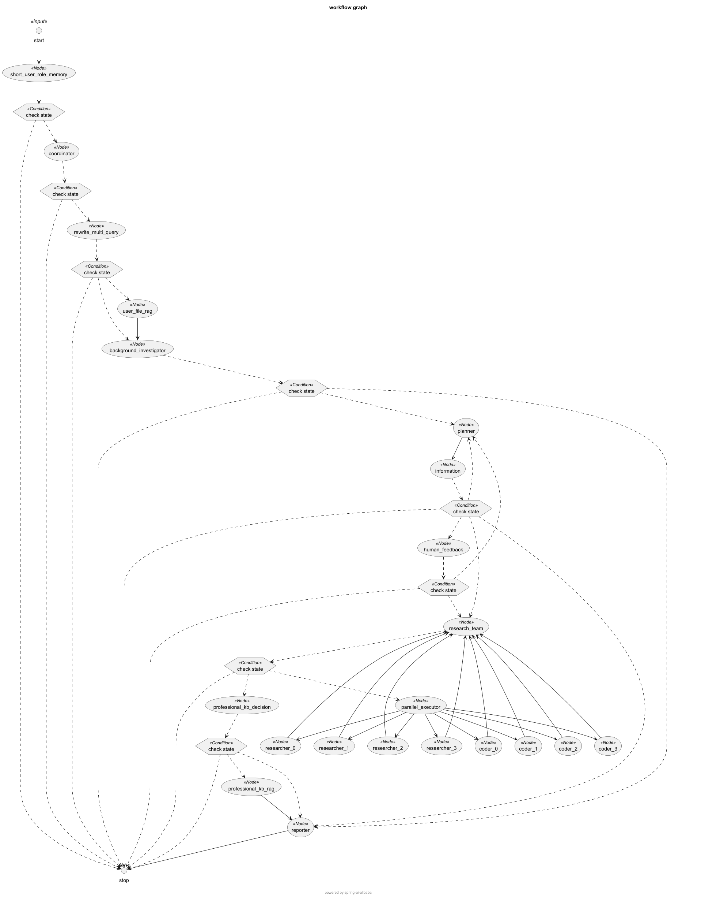

[中文](ARCHITECTURE-zh.md) | [English](ARCHITECTURE.md)

## 架构图

[查看原图](../imgs/deepresearch-workflow.png)

> 上图展示了 deepresearch 的核心模块分层与主要调用关系。

## 主要流程图

> 上图展示了用户请求在 deepresearch 系统中的主要流转流程。

## Graph节点

